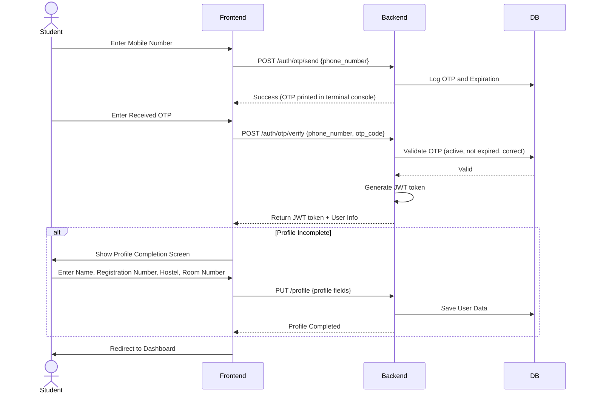
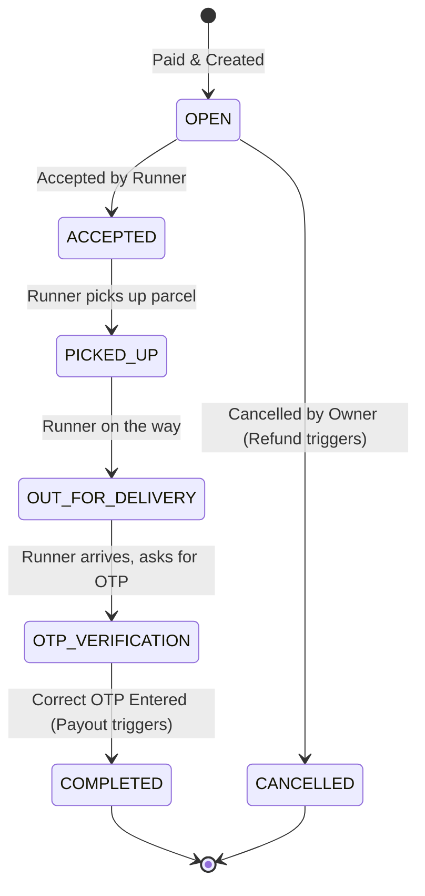
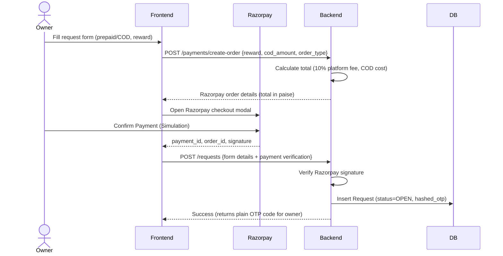
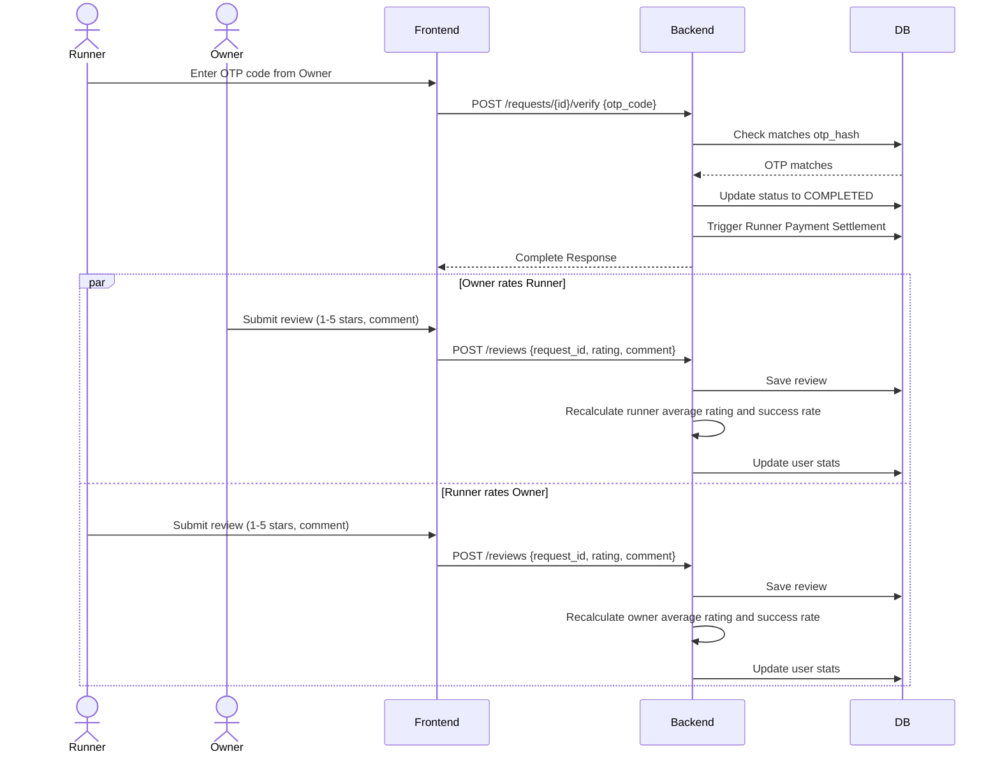

# System Workflow - Campus Runner V1.0

This document maps out the system workflows, authentication sequences, delivery lifecycles, and rating loops.

---

## 1. Authentication Flow

---

## 2. Request Lifecycle State Diagram
A delivery request moves through these states:

---

## 3. Delivery Creation and Payment Flow

---

## 4. Completion and Reputation Updates

